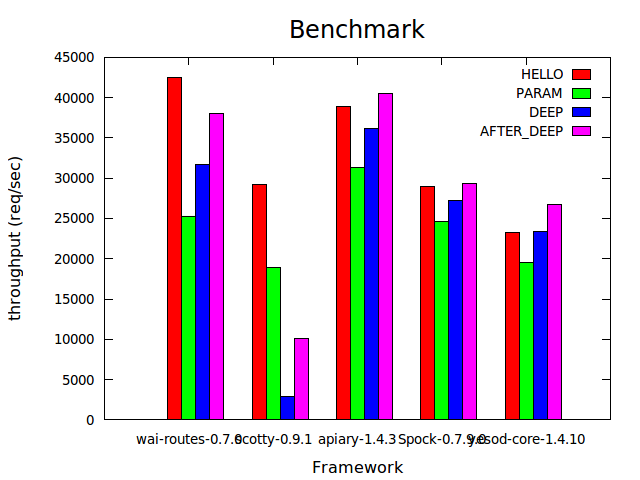

apiary-benchmark
===
benchmark result of haskell lightweight web frameworks.

Frameworks
---
* [apiary](src/apiary.hs)
* [scotty](src/scotty.hs)
* [Spock](src/Spock.hs)
* [yesod](src/yesod.hs)
* [wai-routes](src/wai-routes.hs)

How to run
---
```.sh
cabal update
cabal sandbox init
cabal get apiary-1.4.3 Spock-0.7.9.0 scotty-0.9.1 yesod-core-1.4.10 wai-routes-0.7.0
cabal install apiary-1.4.3 Spock-0.7.9.0 scotty-0.9.1 yesod-core-1.4.10 wai-routes-0.7.0
cabal install -fapiary -fSpock -fyesod-core -fscotty -fwai-routes --only-dependencies
./scripts/all.sh apiary-1.2.3 Spock-0.7.7.0 scotty-0.9.1 yesod-core-1.4.7.2 wai-routes-0.7.0
```

Benchmarks
---
1. HELLO (no capture)
2. PARAM (capture route parameter)
3. DEEP  (deep and many routes)
3. AFTER_DEEP (after DEEP route)

Machines
---

### server1

```.sh
% uname -a
Linux aj-Lenovo-G500s 3.16.0-33-generic #44-Ubuntu SMP Thu Mar 12 12:19:35 UTC 2015 x86_64 x86_64 x86_64 GNU/Linux
% cat /proc/cpuinfo | grep 'model name'
model name      : Intel(R) Core(TM) i5-3230M CPU @ 2.60GHz
model name      : Intel(R) Core(TM) i5-3230M CPU @ 2.60GHz
model name      : Intel(R) Core(TM) i5-3230M CPU @ 2.60GHz
model name      : Intel(R) Core(TM) i5-3230M CPU @ 2.60GHz
% cat /proc/meminfo | grep MemTotal
MemTotal:        8041984 kB
```

Results
---

### single thread



|machine         |ghc    |framework          |HELLO   | PARAM   |DEEP    |AFTER_DEEP|
|----------------|-------|-------------------|--------|---------|--------|----------|
|aj-Lenovo-G500s |7.8.4  |wai-routes-0.7.0   |42527.76| 25314.18|31671.36|38033.70  |
|aj-Lenovo-G500s |7.8.4  |scotty-0.9.1       |29232.77| 18897.44|2907.24 |10063.60  |
|aj-Lenovo-G500s |7.8.4  |apiary-1.4.3       |38879.96| 31273.60|36203.29|40553.63  |
|aj-Lenovo-G500s |7.8.4  |Spock-0.7.9.0      |28967.70| 24613.51|27203.14|29387.92  |
|aj-Lenovo-G500s |7.8.4  |yesod-core-1.4.10  |23204.61| 19590.82|23421.60|26759.88  |


References
---
1. [agrafix/Spock-scotty-benchmark](https://github.com/agrafix/Spock-scotty-benchmark)
